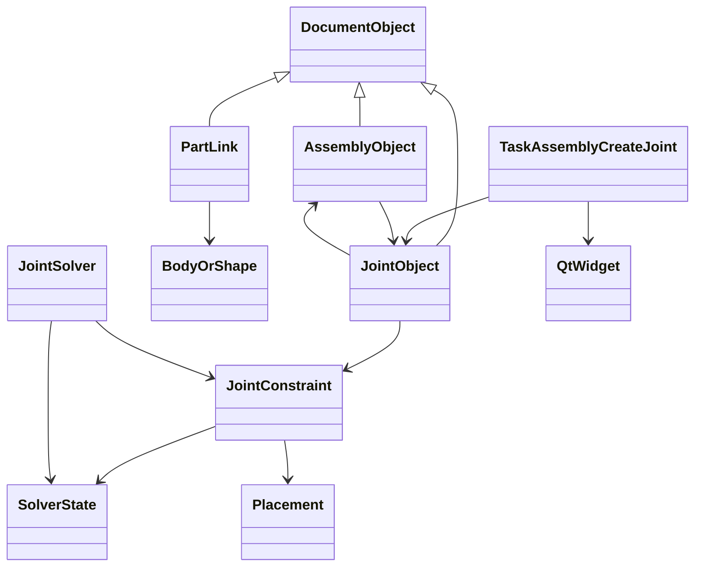

# FreeCAD 26.3 Assembly Solver – Architektur, Ablauf, Klassen und reale Beispiele

Dieser Artikel beschreibt den Assembly-Solver in FreeCAD 26.3 aus Sicht eines Ingenieurs: Was der Solver eigentlich löst, wie er mit Joints und dem Zustandsvektor Q zusammenarbeitet, welche Objekte dabei in der Architektur beteiligt sind und wie der Ablauf zwischen Python, C++/Solver und Qt-GUI zeitlich organisiert ist.

Die Darstellung ist bewusst nicht nur „dokumentarisch“, sondern praktisch: wir zeigen, wie ein Joint eine mathematische Restriktion beschreibt, wie daraus ein Gleichungssystem entsteht und wie der Solver daraus eine neue geometrische Lage berechnet. Dazu ergänzen wir kleine Beispiele mit Joint-Logik, numerischen Schritten und einer realistischen Ablaufbeschreibung für die GUI.

## 1. Überblick: Was der Solver macht

Ein Assembly-Solver in FreeCAD hat eine sehr klare Aufgabe:

- Eine Baugruppe besteht aus mehreren Teilen.
- Die Teile sind nicht einfach nur geometrische Objekte, sondern tragen eine Lage im Raum (Placement).
- Joints definieren Relationen zwischen ihnen, etwa Abstand, Koinzidenz, Drehung, Gleitbewegung oder feste Ausrichtung.
- Der Solver löst die Positionen und Rotationen der Teile so, dass alle Relationsbedingungen möglichst exakt erfüllt sind.

Formal gesprochen:

- Jeder Körper hat einen Zustand q_i.
- Der Gesamtzustand der Baugruppe ist Q = [q_1, q_2, ..., q_n].
- Ein Joint erzeugt eine oder mehrere Gleichungen:
  g_k(Q) = 0
- Der Solver versucht, einen Q-Wert zu finden, der diese Gleichungen erfüllt.

Das hat drei praktische Folgen:

1. Die Baugruppe bleibt konsistent.
2. Geänderte Joints oder Teilpositionen lösen eine Neu-Berechnung aus.
3. Ein Teil kann über seine Kinematik und Constraints nicht mehr „frei im Raum“ herumfliegen, sondern muss sich gemäß der Baugruppenregeln bewegen.

In FreeCAD 26.3 ist das nicht bloß eine geometrische Berechnung: Der Solver ist Teil der Assembly-Architektur, die Joints, Referenzen, Graph-Recompute und View/Gui-Update in einen Ablauf bringt.

## 2. Grundidee: Joints erzeugen Constraints, Q ist der Laufzustand

Die zentrale Struktur ist immer dieselbe:

- Joints = Regeln
- Q = aktueller Zustand
- Solver = verändert Q

### 2.1 Joints

Ein Joint beschreibt eine relationale Bedingung zwischen mindestens zwei Komponenten. Typische Fälle:

- Distance: der Abstand zwischen zwei Bezugspunkten muss konstant sein.
- Coincident: zwei Punkte oder Achsen müssen aufeinander liegen.
- Revolute: Drehung um eine Achse ist erlaubt, andere Relativbewegungen werden eingeschränkt.
- Slider: Translation entlang einer Achse ist erlaubt, Orthogonalbewegungen sind nicht erlaubt.
- Cylindrical: Rotation und Translation entlang derselben Achse sind erlaubt.
- Fixed: die Position ist vollständig fest.

Ein Joint ist dabei nicht nur ein UI-Objekt, sondern ein mathematischer Ausdruck:

- Es nutzt lokale Koordinatensysteme (LCS, Origins, Connector-Systeme).
- Es bildet einen Bezug zwischen Körper A und Körper B.
- Es enthält Parametrisierung wie Offset, Angle, Distance, Limits, Axis.

### 2.2 Q

Q beschreibt die aktuelle Systemkonfiguration der Baugruppe. Für einen einzelnen starren Körper können die Zustandsvariablen zum Beispiel sein:

- x, y, z  (Translation)
- rx, ry, rz (Rotation)

für mehrere Körper zusammen als Vektor:

Q = [x_1, y_1, z_1, rx_1, ry_1, rz_1, ..., x_n, y_n, z_n, rx_n, ry_n, rz_n]^T

Es ist der Zustand, den der Solver „bewegt“, nicht nur ein einzelnes Objekt.

### 2.3 Das Solver-Prinzip

Jeder Joint erzeugt ein Residuum r(Q):

r(Q) = g(Q)

Wenn r(Q) = 0, dann ist der Zustand konsistent. Wenn nicht, versucht der Solver, ΔQ so zu wählen, dass r(Q + ΔQ) näher an 0 kommt.

Das klassische Verfahren ist Newton oder Newton-artige Linearisierung:

J(Q) ΔQ = -r(Q)

wobei J(Q) die Jacobian-Matrix ist, die jede Beziehung nach allen Zustandsvariablen ableitet.

Diese Methode ist die Grundlage vieler Assembly-Solver, auch wenn die konkrete C++-Implementierung in FreeCAD mehrere zusätzliche Mechaniken nutzt:

- Sparsity / Blockstrukturen
- Dämpfung und Regularisierung
- Unterbestimmte Fälle
- Einschränkung von Nullraum-Bewertungen
- Geerdete Teile / feste Referenzteile

## 3. Mathematische Sicht: Joints als Constraints

### 3.1 Distance-Joint

Für zwei Punkte p1 und p2 gilt:

f(Q) = ||p2(Q) - p1(Q)|| - d = 0

wobei d der gewünschte Abstand ist.

Der Jacobian ist die Ableitung dieser Funktion nach Q:

J = ∂f/∂Q

Der Solver linearisiert um den aktuellen Zustand:

f(Q + ΔQ) ≈ f(Q) + J ΔQ

und löst dann:

J ΔQ = -f(Q)

### 3.2 Coincident-Joint

Wenn zwei Punkte identisch liegen sollen, dann:

f(Q) = p2(Q) - p1(Q)

Das ist ein Vektor von 3 Komponenten, also 3 Gleichungen.

### 3.3 Slider-Joint

Ein Slider erlaubt Bewegung entlang einer Achse u, aber nicht um die orthogonalen Richtungen. Beispiel:

- u = Schiebeachse
- p2 - p1 = v
- Bedingungen:
  u_perp1 · v = 0
  u_perp2 · v = 0

Damit bleiben nur die Projektionen entlang u frei. Die übrigen Freiheitsgrade sind gelöscht.

Das ist genau die Stelle, an der ein „schlechter Solver-Initialzustand“ zu einer falschen Lösung führen kann, wenn der erste Recompute unvollständig oder in einem inkonsistenten Zustand startet. Genau das ist in der Praxis bei FreeCAD 26.3 bei Slider-Ketten und unvollständigen Recompute-Kaskaden relevant geworden.

## 4. Architektur im Überblick: die beteiligten Klassen und Objekte

Die Assembly-Architektur kann man grob in mehrere Schichten aufteilen:

- Dokument-/Objekt-Schicht: Assembly-Objekt, Teile, Links, Joints
- Constraint-Schicht: Joint-Definitionen, Parameter, Referenzen
- Solver-Schicht: Zustandsvektor, Residuum, Jacobian, Iteration
- GUI/Interaction-Schicht: Qt, Selection, Task dialogs, view updates

### 4.1 Klassendiagramm



### 4.2 Klassenbeschreibung

#### AssemblyObject

Das Assembly-Objekt ist der zentrale Hub:

- verwaltet die Liste der Joints,
- ermittelt Verbindungen zwischen Teilen,
- startet Recompute und Solve,
- organisiert den assembly graph.

Funktionen typischerweise:

- addJoint(...)
- getJoints()
- solve()
- recompute()
- isPartConnected()
- resolveReferences()

#### JointObject

Das Joint-Objekt beschreibt die geometrische Beziehung zwischen zwei Referenzobjekten. Es hält:

- Reference1 / Reference2
- Type (Distance, Revolute, Slider, Fixed, ...)
- Parameter (Offset, Angle, Limit, Axis)
- Placement1 / Placement2
- State / invalid / dirty status

#### JointConstraint

Der Constraint ist die mathematische Repräsentation eines Joints. Typische Eigenschaften:

- Art der Restriktion
- Geometrische Bezugspunkte / Achsen
- Residuum-Formel
- Jacobian-Block
- Parameter- und Limitprüfung

#### SolverState oder Q-Container

Ein Zustandscontainer hält den aktuellen Zustand aller Objekte:

- q: numerische Zustandswerte
- residual
- Jacobian
- iteration count
- convergence status

#### JointSolver / OndselSolver

Das eigentliche Numerik-Subsystem verarbeitet die Ketten von Constraints. Es berechnet:

- residuals
- Jacobian matrix blocks
- update vectors
- convergence loop

Unabhängig davon, ob der Code in C++ oder Python liegt, ist das die gleiche generische Idee: Werte nicht direkt „rausmalen“, sondern analytisch iterativ lösen.

#### TaskAssemblyCreateJoint

Das GUI-Task-Widget, das der Benutzer in FreeCAD sieht. Es verwaltet:

- Auswahl der Referenzen,
- Anzeige der Joint-Parameter,
- Validierung der Eingaben,
- Propagierung an das Joint-Objekt,
- Start/Ende des Dialogs.

## 5. Ablauf: Wie Solve und Recompute in FreeCAD zeitlich zusammenlaufen

Die typische Reihenfolge eines FreeCAD-Assembly-Workflows sieht so aus:

1. Nutzer wählt Teile und Joint-Type.
2. Joint-Dialog wird geöffnet (Qt/PySide6).
3. Python-Task/Widget setzt die Joint-Parameter.
4. Joint-Objekt wird erstellt/aktualisiert.
5. Ein Recompute des Dokuments wird ausgelöst.
6. Die Assembly-Objekt-Logik sammelt Joints und Referenzen.
7. Der Solver berechnet einen neuen Q-Zustand.
8. Die neuen Placements werden auf die Parts/Links angewandt.
9. GUI rendert die neue Lage in der 3D-Ansicht.

### 5.1 Zeitlicher Ablauf in einer simplen Reihenfolge

```text
User input
   ↓
Qt Event Loop
   ↓
TaskAssemblyCreateJoint / selection changes
   ↓
JointObject updated
   ↓
Document recompute triggered
   ↓
AssemblyObject::solve() / graph rebuild
   ↓
JointConstraint residuals + Jacobian
   ↓
Newton / Least-Squares iteration
   ↓
Q := Q + ΔQ
   ↓
Placement updated
   ↓
Gui update / View redraw
```

### 5.2 Wichtiger Punkt: nicht alles läuft im selben Thread

Der Benutzer-Dialog und die 3D-Ansicht laufen in der Qt-Haupt-Eventloop. Numerische Solver-Rechnung kann aber je nach Architektur in:

- Main thread,
- Worker thread,
- oder einer rechenintensiven C++-Schicht

laufen. In der Praxis sind zwei Dinge wichtig:

1. GUI-Updates immer im Main Thread.
2. Long-running solver work darf die UI nicht blockieren.

Die typische Fehlermuster-Strategie ist:

- Numerik im Worker, Ergebnis zurück an Main thread,
- Main thread setzt nur die Final-Placements und löst eine Recompute-Schleife aus.

## 6. Qt/PySide6: Warum das Zusammenspiel zentral ist

Beim Arbeiten mit FreeCAD 26.3 ist Qt an mehreren Stellen beteiligt:

- Auswahl von Referenzobjekten in der 3D-Ansicht
- Joint-Parameter im Dialog
- Live-Update von Spinboxes, Textfelder, ComboBoxen
- Recompute-Trigger nach Property-Änderungen
- Redraw der View-Ansicht nach Erfolgs-/Fehlerfall

### 6.1 Der typische GUI-Trigger

Der Ablauf sieht oft so aus:

1. Python-Slot im Dialog feuert.
2. Property ändert sich.
3. FreeCAD registriert Änderung.
4. `onChanged` oder `preSolve`-Hooks laufen.
5. Das Assembly-Objekt meldet sich zum Recompute.
6. Qt-Eventloop aktualisiert die Oberfläche.

Wird der Solver direkt auf dem GUI-Thread ausgeführt, kann die UI „einfrieren“. Deshalb ist das Timing ein entscheidender Faktor in realen CAD-Anwendungen.

### 6.2 Beispiel: Qt-Eventloop und Solver-Trigger

```python
from PySide6 import QtCore

class SolverController(QtCore.QObject):
    solveFinished = QtCore.Signal(object)

    def __init__(self, assembly):
        super().__init__()
        self.assembly = assembly

    def request_solve(self):
        # GUI-Thread: nur Anfrage starten
        self._do_solve_async()

    def _do_solve_async(self):
        worker = QtCore.QThreadPool.globalInstance()
        task = SolveTask(self.assembly)
        task.finished.connect(self._on_solve_done)
        worker.start(task)

    def _on_solve_done(self, result_q):
        # Rückkehr in den GUI-Thread
        self.assembly.set_q(result_q)
        self.solveFinished.emit(result_q)
```

Das ist ein typisches Muster: Der GUI-Thread startet nur, und die Berechnung läuft außerhalb der UI-Schleife. Danach kehrt der Code in den Main Thread zurück und aktualisiert das Dokument.

### 6.3 Wichtige GUI-Regeln in CAD

- GUI-Objekte nur im Main Thread ändern.
- `App.ActiveDocument`/`Gui`-Objekte bevorzugt im Main Thread aktualisieren.
- Während eines laufenden Solves keine Dialog-Elemente mutieren.
- Redraw nur nach finalem Update, nicht mitten im Solver-Lauf.

## 7. Kleine realistische Solver-Beispiele mit Joints

### 7.1 Beispiel A: Ein einfacher Distance-Joint

Das mathematische Verhalten:

- Teil A und Teil B sollen sich genau 50 mm voneinander entfernt befinden.
- Der Solver versucht, die Position von B so zu verschieben, dass die Distanz 50 mm ist.

Pseudo-Algorithmus:

```python
import numpy as np

# Zustandsvektor: [xA, yA, zA, xB, yB, zB]
Q = np.array([0.0, 0.0, 0.0, 10.0, 0.0, 0.0], dtype=float)
desired = 50.0

for _ in range(20):
    pA = Q[:3]
    pB = Q[3:]
    v = pB - pA
    f = np.linalg.norm(v) - desired
    if abs(f) < 1e-9:
        break

    J = np.zeros((1, 6))
    L = np.linalg.norm(v)
    if L < 1e-9:
        L = 1e-9
    direction = v / L
    J[0, :3] = -direction
    J[0, 3:] = direction

    step = -np.linalg.pinv(J) @ np.array([f])
    Q = Q + 0.7 * step

print(Q)
```

Ergebnis: Der Abstand zwischen A und B wird auf 50 mm korrigiert.

### 7.2 Beispiel B: Coincident-Joint

Zwei Punkte sollen aufeinander liegen:

f(Q) = pB - pA

Das führt zu 3 Residuen. Das System ist einfach: die Differenz zwischen den Punkten muss 0 sein.

```python
import numpy as np

Q = np.array([0.0, 0.0, 0.0, 5.0, 1.0, 2.0], dtype=float)

for _ in range(20):
    pA = Q[:3]
    pB = Q[3:]
    r = pB - pA
    if np.linalg.norm(r) < 1e-9:
        break

    J = np.hstack([
        -np.eye(3),
        np.eye(3)
    ])
    step = -np.linalg.pinv(J) @ r
    Q = Q + 0.5 * step

print(Q)
```

Diese Form ist die direkte, numerische Darstellung eines Coincident-Joints im Solver.

### 7.3 Beispiel C: Slider-Joint mit freier Schiebeachse

Ein Slider hat eine erklärte freie Richtung u und verbietet alle Bewegungen orthogonal dazu. Für die Lösung bedeutet das:

- Orthogonale Projektion muss 0 sein
- Along-axis-Komponente bleibt frei oder wird durch ein zusätzliches Distance-Constraint bestimmt

```python
import numpy as np

u = np.array([0.0, 0.0, 1.0])  # Schiebeachse Z
pA = np.array([0.0, 0.0, 0.0])
pB = np.array([2.0, 4.0, 1.0])

# Orthogonalbedingungen: (pB-pA) dot u_perp = 0
# In diesem Beispiel: nur eine freie Z-Komponente bleibt erlaubt.
# Korrigiere die X/Y-Abweichungen.

v = pB - pA
# u_perp-Dir. (im konkreten 3D-Fall zwei je orthogonale Vektoren)
perp1 = np.array([1.0, 0.0, 0.0])
perp2 = np.array([0.0, 1.0, 0.0])

r = np.array([
    np.dot(v, perp1),
    np.dot(v, perp2)
])

# Matrix J for xA,yA,xB,yB etc. would be assembled here.
print(r)
```

Das ist eine stark vereinfachte, didaktische Darstellung. In einem echten Assembly-Solver werden die Richtungen lokaler Achsen und Multipler aus dem Joint-Definition-Objekt genommen.

## 8. Beispiel mit realen FreeCAD-Assembly-Objekten

Wenn man in FreeCAD 26.3 eine kleine Assembly mit einem Distance-Joint aufbaut, ist der typische Ablauf in Python/Workbench-Umgebung ungefähr so:

```python
import FreeCAD as App
import FreeCADGui as Gui

# 1. Dokument vorbereiten
# Erzeugt ein neues Dokument und baut zwei Boxen
# (Pseudocode: echte API kann je nach FreeCAD-Version leicht abweichen)
doc = App.newDocument("SolverDemo")

partA = doc.addObject("Part::Box", "PartA")
partB = doc.addObject("Part::Box", "PartB")
partB.Placement.Base = App.Vector(100, 0, 0)

# 2. Assembly-Objekt
assembly = doc.addObject("Assembly::AssemblyObject", "Assembly")

# 3. Joints hinzufügen (konzeptionell; genaue API je nach Revision variieren)
# joint = doc.addObject("Assembly::Joint", "DistanceJoint")
# joint.Type = "Distance"
# joint.Reference1 = partA
# joint.Reference2 = partB
# joint.Distance = 100.0

# 4. Solve aufrufen
# assembly.solve()
# oder: doc.recompute()

# 5. Ergebnis prüfen
# print(partA.Placement.Base)
# print(partB.Placement.Base)
```

Die wichtige Sache hier ist nicht die genaue Methode in einer Revision, sondern die Logik:

- Teile existieren.
- Joints werden mit Referenzen und Typ gesetzt.
- Solver rechnet das kinematische Netzwerk neu.
- Placements werden aktualisiert.

## 9. Warum die Reihenfolge von Recompute und Solver wichtig ist

Ein zentraler Punkt bei FreeCAD 26.3 ist: Nicht nur eine einzelne Funktion „macht alles“, sondern mehrere Schichten reagieren in der richtigen Reihenfolge. Das ist die Quelle vieler Bugs und verschiedener Reproduceable-Fehler.

Typischer Ablauf mit Stolpersteinen:

1. Joint-Parameter ändern sich.
2. Trigger feuert in Property-/Klassik-Callbacks.
3. `preSolve()` / `matchJCS()` kann schon laufen.
4. Ein Teil des Systems hat den Joint noch nicht vollständig als registriert / solved erkannt.
5. Dadurch wird ein „falscher Startzustand“ Q_0 gebildet.
6. Newton-Schritte laufen aus diesem inkonsistenten Startzustand.
7. Das Ergebnis ist eine falsche Position, eine Kette aus ineinandergreifenden Slider-Constraints oder lokales Springen auf falsche Platzierungen.

Das ist genau einer der Gründe, warum die Reihenfolge:

- Joint install -> property update -> recompute -> solve -> placement commit -> gui redraw

so wichtig ist.

## 10. Was ist der Unterschied zwischen Solver-Fehler und GUI-Fehler?

Ein typischer Irrtum ist, den Solver als „graphische Anzeige-Problem“ zu verstehen. In Wirklichkeit sind zwei Ebenen getrennt:

- Solver-Fehler: mathematische oder grafische Kinematik ist falsch
- GUI/Update-Fehler: UI zeigt den neuen Zustand nicht korrekt oder verändert ihn vorher/unterwegs erneut

Ein realer Recompute-Fehler kann im Endeffekt aussehen wie ein Sichtfehler, ist aber in der Logik oft ein Timing-/State-Problem. In FreeCAD 26.3 ist diese Unterscheidung besonders wichtig, weil die selben Joints sowohl mathematisch als auch UI-seitig Einfluss auf Ereignisreihenfolge und View-Updates haben.

## 11. Was man als Ingenieur aus dem Solver lernen sollte

Wenn du mit Assemblies in FreeCAD arbeitet, solltest du zwei Dinge immer im Blick haben:

1. Joints sind keine bloßen Icons, sondern mathematische Constraints.
2. Q ist der echte Zustand der Baugruppe, der iterativ korrigiert wird.

Wenn du die Baugruppenmechanik wirklich verstehst, kannst du Fehler leichter identifizieren:

- Warum springt ein Teil weg?
- Warum bleibt ein Joint „falsch“ stehen?
- Warum kollabiert eine Kette beim ersten Recompute?
- Warum verschieben sich Teile bei einem UI-Dialog?
- Warum entstehen inkonsistente Startwerte?

Die Antwort liegt meistens in einem dieser Punkte:

- falscher Anfangszustand,
- inkonsistente Joint-Referenzen,
- falsche Reihenfolge von recompute/solve,
- unvollständiger Constraint-Set,
- oder Kette mit ungesicherten Freiheitsgraden.

## 12. Zusammenfassung

Der Assembly-Solver in FreeCAD 26.3 ist die Schicht, die aus mathematischen Beziehungen eine konsistente Baugruppenlage erzeugt. Die wichtigsten Akteure sind:

- Joints, die Constraints definieren,
- Q, der Zustandsvektor der Baugruppe,
- Solver, der den Zustand iterativ korrigiert,
- Qt/PySide6, der die Interaktion und das Sichtbarmachen steuert,
- und die Assembly-Architektur, die Recompute, Joint-Parameter und Geometry in einen Ablauf verknüpft.

Die Kernidee lässt sich in einem Satz zusammenfassen:

Joints geben die Regeln vor, Q beschreibt den Zustand und der Solver sorgt dafür, dass die Regeln auf allen Teilen konsistent erfüllt werden.

Wenn man dieses Modell verstanden hat, wird die Assembly-Mechanik in FreeCAD deutlich klarer: Es ist nicht „nur Geometrie“, sondern ein dynamisches System mit Zuständen, Constraints und numerischer Berechnung.

---

Datei: resources/docs/ASSEMBLY_SOLVER_ARTICLE.md
